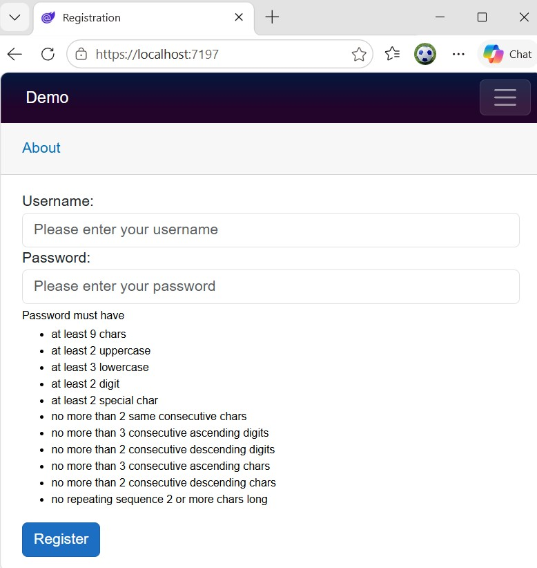
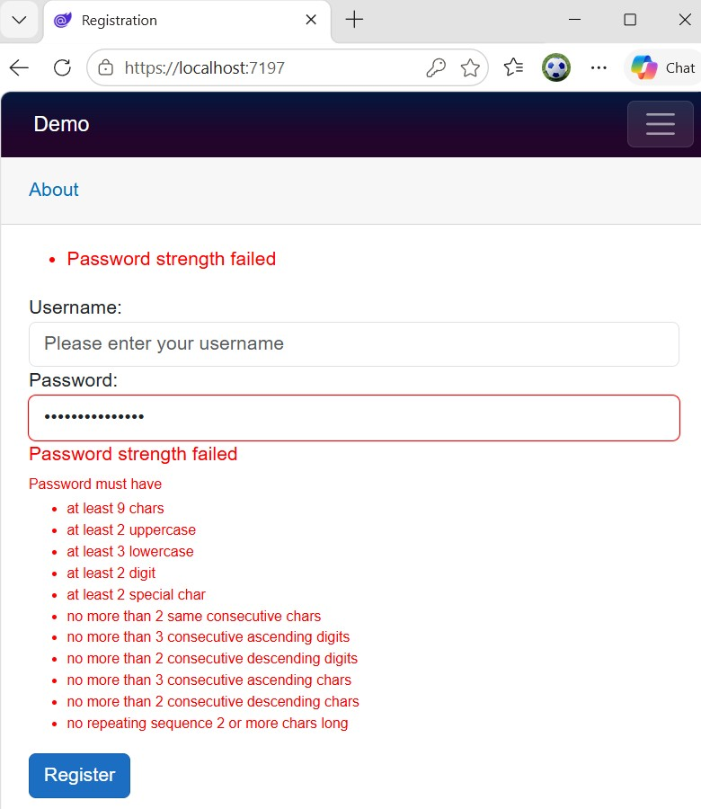
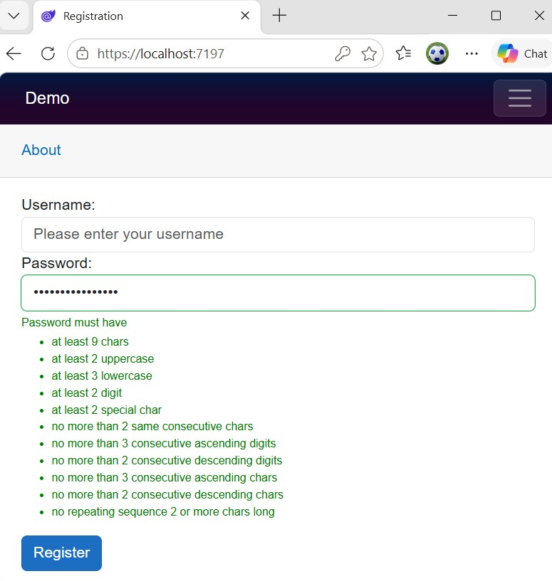

# MyPasswordStrength.Blazor

[](https://github.com/VeritasSoftware/PasswordStrengthDataAnnotation/actions/workflows/dotnet.yml)

> A .NET Blazor library for validating password strength based on customizable complexity requirements.

Define your password strength complexity requirements with ease using the library. 

The Validator supports `multilingual` password strength validation too.

You can configure:

* Desired language
* Minimum length
* Minimum upper case characters
* Minimum lower case characters
* Minimum digits
* Minimum special characters
* Maximum same consecutive characters - eg aaa
* Maximum consecutive ascending and/or descending digits - eg 123 / 654
* Maximum consecutive ascending and/or descending characters - eg aBCd / DcbA
* Repeated sequence check - eg in P@ssword@s - @s is repeating sequence 

## Background

The package provides a `PasswordStrength` Component that you can use to validate passwords in your .NET Blazor applications.

The Component hooks into Blazor's form validation system and provides real-time feedback on password strength as the user types.

You can set the password strength requirements through the properties of the `MyPasswordStrengthOptions` class and pass the options to the Component.

The special characters considered in the validation are: **!"#$%&'()*+,-./:;<=>?@[\\]^_`{|}~**. 

You can modify this set of special characters by setting the `SpecialCharacters` property of the options to a custom string of special characters.

## Sample Usage

### The User model

```csharp
using System.ComponentModel.DataAnnotations;

namespace YourNamespace.Models
{
    public class UserModel
    {
        [Required(ErrorMessage = "Username is required")]
        public string Username { get; set; } = string.Empty;

        [Required(ErrorMessage = "Password is required")]
        public string Password { get; set; } = string.Empty;
    }
}
```

### Razor page

`Registration.razor`:

```razor
@page "/"
@using MyPasswordStrength.Blazor
@using Models

<PageTitle>Registration</PageTitle>

<EditForm Model="@user" OnValidSubmit="HandleValidSubmit">
    <DataAnnotationsValidator />
    <ValidationSummary />

    <div>
        <label>Username:</label>
        <InputText @bind-Value="user.Username" class="form-control" placeholder="Enter username" />
        <ValidationMessage For="@(() => user.Username)" />
    </div>

    <div>
        <label>Password:</label>
        <PasswordStrength
            @bind-Value="user.Password"
            class="form-control"
            Placeholder="Please enter your password"
            OnValidation="HandleOnValidation"
            StrengthOptions="@StrengthOptions"
            ErrorMessage="Password strength failed"
        />
        <ValidationMessage For="@(() => user.Password)" />
        <span style=@($"font-size:12px; color:{(isError == null? "black" : (isError == true ? "red" : "green" ))}")>
            Password must have
            <ul>
                <li>at least 9 chars</li>
                <li>at least 2 uppercase</li>
                <li>at least 3 lowercase</li>
                <li>at least 2 digit</li>
                <li>at least 2 special char</li>
                <li>no more than 2 same consecutive chars</li>
                <li>no more than 3 consecutive ascending digits</li>
                <li>no more than 2 consecutive descending digits</li>
                <li>no more than 3 consecutive ascending chars</li>
                <li>no more than 2 consecutive descending chars</li>
                <li>no repeating sequence 2 or more chars long</li>
            </ul>
        </span>        
    </div>

    <button type="submit" class="btn btn-primary">Register</button>
</EditForm>

@code {
    private UserModel user = new();
    private bool? isError = null;

    private MyPasswordStrengthOptions StrengthOptions
    {
        get
        {
            return new MyPasswordStrengthOptions
            {
                MinimumLength = 9,
                RequireUppercase = true,
                MinimumUppercase = 2,
                RequireLowercase = true,
                MinimumLowercase = 3,
                RequireDigit = true,
                MinimumDigit = 2,
                RequireSpecialCharacter = true,
                MinimumSpecialCharacter = 2,
                RequireMaximumNoOfSameConsecutiveCharacters = true,
                MaximumNoOfSameConsecutiveCharacters = 2,
                RequireMaximumNoOfConsecutiveAscendingDigits = true,
                MaximumNoOfConsecutiveAscendingDigits = MaximumNoOfConsecutiveDigits.Three,
                RequireMaximumNoOfConsecutiveDescendingDigits = true,
                MaximumNoOfConsecutiveDescendingDigits = MaximumNoOfConsecutiveDigits.Two,
                RequireMaximumNoOfConsecutiveAscendingCharacters = true,
                MaximumNoOfConsecutiveAscendingCharacters = MaximumNoOfConsecutiveCharacters.Three,
                RequireMaximumNoOfConsecutiveDescendingCharacters = true,
                MaximumNoOfConsecutiveDescendingCharacters = MaximumNoOfConsecutiveCharacters.Two,
                RequireRepeatingSequenceCheck = true,
                MinimumLengthOfRepeatingSequence = 2
            };
        }
    }

    private void HandleOnValidation(string? pwd, bool? isValid)
    {
        //Console.WriteLine($"Password: {pwd}, IsValid: {isValid}");

        isError = !isValid;

        StateHasChanged();
    }

    private void HandleValidSubmit()
    {
        // Handle registration logic here
        //Console.WriteLine($"Username: {user.Username}, Password: {user.Password}");
    }
}
```

## Multilingual feature

The component supports below languages.

* English (default)
* Bangla
* Hindi
* Punjabi
* Chinese
* Korean
* Japanese
* Urdu
* Arabic
* Hebrew

You can set a property of the `MyPasswordStrengthOptions` options called `Language`.

For languages other than English, properties `RequireLowercase` & `MinLowercase` do not apply.

### Initial



### Invalid



### Valid



## License

MIT © [VeritasSoftware](https://github.com/VeritasSoftware)