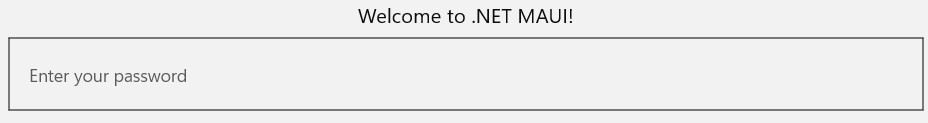
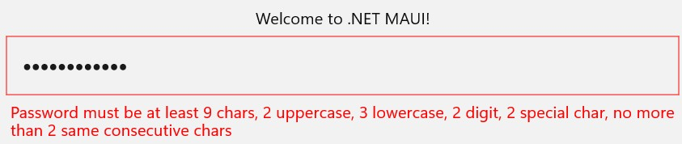
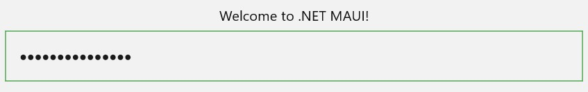

# MyPasswordStrength.NET.MAUI

[](https://github.com/VeritasSoftware/PasswordStrengthDataAnnotation/actions/workflows/dotnet.yml)

|**Packages**|Version|Downloads|
|---------------------------|:---:|:---:|
|*MyPasswordStrength.NET.MAUI*|[](https://www.nuget.org/packages/MyPasswordStrength.NET.MAUI)|[](https://www.nuget.org/packages/MyPasswordStrength.NET.MAUI)|

> A .NET MAUI library for validating password strength based on customizable complexity requirements.

You can configure:

* Minimum length
* Minimum upper case characters
* Minimum lower case characters
* Minimum digits
* Minimum special characters
* Maximum same consecutive characters - eg aaa
* Maximum consecutive ascending and/or descending digits - eg 123 / 654
* Maximum consecutive ascending and/or descending characters - eg aBCd / DcbA

## Background

Define your password strength complexity requirements with ease using the library. 

The package provides a `PasswordStrengthEntry` Entry that you can use to validate passwords in your .NET MAUI applications.

You can set the password strength requirements through the properties of the `MyPasswordStrengthOptions` class and pass the options to the Entry.

The special characters considered in the validation are: !"#$%&'()*+,-./:;<=>?@[\]^_`{|}~. 

You can modify this set of special characters by setting the `SpecialCharacters` property of the options to a custom string of special characters.

## Sample Usage

### XAML page

`RegistrationPage.xaml`:

```xaml
<?xml version="1.0" encoding="utf-8" ?>
<ContentPage xmlns="http://schemas.microsoft.com/dotnet/2021/maui"
             xmlns:x="http://schemas.microsoft.com/winfx/2009/xaml"
             xmlns:pwd="clr-namespace:MyPasswordStrength;assembly=MyPasswordStrength.NET.MAUI"
             x:Class="YourNamespace.Pages.RegistrationPage"
             Title="Registration"
             x:Name="registrationPage">
    <VerticalStackLayout>
        <Label 
            Text="Welcome to .NET MAUI!"
            VerticalOptions="Center" 
            HorizontalOptions="Center" />

        <Border x:Name="border" Stroke="Black" StrokeThickness="2">
            <pwd:PasswordStrengthEntry
                x:Name="passwordStrength"
                Placeholder="Please enter password" />
        </Border>

        <Label
            x:Name="errorLabel"
            Text="Password must be at least 9 chars, 2 uppercase, 3 lowercase, 2 digit, 2 special char, no more than 2 same consecutive chars, no more than 3 consecutive ascending digits, no more than 2 consecutive descending digits, no more than 3 consecutive ascending chars, no more than 2 consecutive descending chars"
            FontSize="24"
            IsVisible="False"
            TextColor="Red"
            HorizontalOptions="Center" />
    </VerticalStackLayout>
</ContentPage>
```
`RegistrationPage.xaml.cs`:

```csharp
using MyPasswordStrength;

namespace YourNamespace.Pages;

public partial class RegistrationPage : ContentPage
{
	public RegistrationPage()
	{        
        InitializeComponent();

        passwordStrength.StrengthOptions = StrengthOptions;
        passwordStrength.OnValidation = HandleOnValidation;
    }

    private MyPasswordStrengthOptions StrengthOptions
    {
        get
        {
            return new MyPasswordStrengthOptions
            {
                MinimumLength = 9,
                RequireUppercase = true,
                MinimumUppercase = 2,
                RequireLowercase = true,
                MinimumLowercase = 3,
                RequireDigit = true,
                MinimumDigit = 2,
                RequireSpecialCharacter = true,
                MinimumSpecialCharacter = 2,
                RequireMaximumNoOfSameConsecutiveCharacters = true,
                MaximumNoOfSameConsecutiveCharacters = 2,
                RequireMaximumNoOfConsecutiveAscendingDigits = true,
                MaximumNoOfConsecutiveAscendingDigits = MaximumNoOfConsecutiveDigits.Three,
                RequireMaximumNoOfConsecutiveDescendingDigits = true,
                MaximumNoOfConsecutiveDescendingDigits = MaximumNoOfConsecutiveDigits.Two,
                RequireMaximumNoOfConsecutiveAscendingCharacters = true,
                MaximumNoOfConsecutiveAscendingCharacters = MaximumNoOfConsecutiveCharacters.Three,
                RequireMaximumNoOfConsecutiveDescendingCharacters = true,
                MaximumNoOfConsecutiveDescendingCharacters = MaximumNoOfConsecutiveCharacters.Two
            };
        }
    }

    private async void HandleOnValidation(string pwd, bool isValid)
    {
        if (isValid)
        {
            border.Stroke = Colors.Green;
            errorLabel.IsVisible = false;
        }
        else
        {
            border.Stroke = Colors.Red;
            errorLabel.IsVisible = true;
        }
    }
}
```

### Code only

`Registration.cs`:

```c#
using Microsoft.Maui.Controls.Shapes;
using MyPasswordStrength;
using System.Runtime.Versioning;

namespace YourNamespace.Pages;

[SupportedOSPlatform("android")]
[SupportedOSPlatform("ios")]
[SupportedOSPlatform("maccatalyst")]
[SupportedOSPlatform("windows")]
public class Registration : ContentPage
{    
    private readonly PasswordStrengthEntry _entry;
    private readonly Border _border;
    private readonly Label _errorLabel;

    public Registration()
    {
        var content = new VerticalStackLayout
        {
            Children = {
                new Label {
                    HorizontalOptions = LayoutOptions.Center,
                    VerticalOptions = LayoutOptions.Center,
                    Text = "Welcome to .NET MAUI!"
                }
            }
        };

        _entry = new PasswordStrengthEntry(HandleOnValidation, StrengthOptions, "Enter your password")
        {
            HorizontalOptions = LayoutOptions.Fill,
            VerticalOptions = LayoutOptions.Fill
        };        

        _border = new Border
        {
            Stroke = Colors.Black,          // Border color
            StrokeThickness = 1,          // Border width in device-independent units
            StrokeShape = new Rectangle(),  //Square border 
            Margin = 10,
            Content = _entry            
        };

        _errorLabel = new Label
        {
            Text = "Password must be at least 9 chars, 2 uppercase, 3 lowercase, 2 digit, 2 special char, no more than 2 same consecutive chars, no more than 3 consecutive ascending digits, no more than 2 consecutive descending digits, no more than 3 consecutive ascending chars, no more than 2 consecutive descending chars",
            TextColor = Colors.Red,
            HorizontalOptions = LayoutOptions.Center,
            VerticalOptions = LayoutOptions.Center,
            IsVisible = false
        };

        content.Children.Add(_border);
        content.Children.Add(_errorLabel);

        Content = content;
    }

    private MyPasswordStrengthOptions StrengthOptions
    {
        get
        {
            return new MyPasswordStrengthOptions
            {
                MinimumLength = 9,
                RequireUppercase = true,
                MinimumUppercase = 2,
                RequireLowercase = true,
                MinimumLowercase = 3,
                RequireDigit = true,
                MinimumDigit = 2,
                RequireSpecialCharacter = true,
                MinimumSpecialCharacter = 2,
                RequireMaximumNoOfSameConsecutiveCharacters = true,
                MaximumNoOfSameConsecutiveCharacters = 2,
                RequireMaximumNoOfConsecutiveAscendingDigits = true,
                MaximumNoOfConsecutiveAscendingDigits = MaximumNoOfConsecutiveDigits.Three,
                RequireMaximumNoOfConsecutiveDescendingDigits = true,
                MaximumNoOfConsecutiveDescendingDigits = MaximumNoOfConsecutiveDigits.Two,
                RequireMaximumNoOfConsecutiveAscendingCharacters = true,
                MaximumNoOfConsecutiveAscendingCharacters = MaximumNoOfConsecutiveCharacters.Three,
                RequireMaximumNoOfConsecutiveDescendingCharacters = true,
                MaximumNoOfConsecutiveDescendingCharacters = MaximumNoOfConsecutiveCharacters.Two
            };
        }
    }

    private async void HandleOnValidation(string pwd, bool isValid)
    {
        if (isValid)
        {
            _border.Stroke = Colors.Green;
            _errorLabel.IsVisible = false;
        }
        else
        {
            _border.Stroke = Colors.Red;
            _errorLabel.IsVisible = true;
        }
    }
}
```

### Initial



### Invalid



### Valid



## License

MIT © [VeritasSoftware](https://github.com/VeritasSoftware)