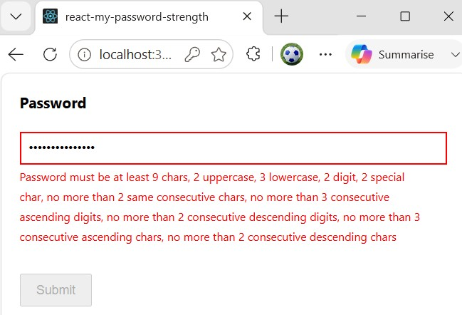

# react-my-password-strength

[](https://github.com/VeritasSoftware/PasswordStrengthDataAnnotation/actions/workflows/react.node.js.yml)

|**Packages**|Version|Downloads|
|---------------------------|:---:|:---:|
|*react-my-password-strength*|[](https://www.npmjs.com/package/react-my-password-strength)|[](https://www.npmjs.com/package/react-my-password-strength)|

> A React library for validating password strength based on customizable complexity requirements.

## Install

```bash
npm install --save react-my-password-strength
```

Use `--force` option with the above command if you get any version issues.

## Background

Define your password strength complexity requirements with ease using the library. 

The package provides a `PasswordStrength` component that you can use to validate passwords in your react forms.

You can set the password strength requirements through the properties of the `MyPasswordStrengthOptions` class and pass the options to the function.

The special characters considered in the validation are: @$!%*?&. 

You can modify this set of special characters by setting the `specialCharacters` property of the options to a custom string of special characters.

### Sample Usage

```tsx
import React, { useState } from 'react'
import { PasswordStrength, MyPasswordStrengthOptions } from 'react-my-password-strength'

const App = () => {
  const [formData, setFormData] = useState({});
  const [formValid, setFormValid] = useState(false);

  const [error, setError] = useState("");

  const handleOnValidation = (name:string, value:string, isValid:boolean) => {
    setError(isValid ? "" : "Password must be at least 9 chars, 2 uppercase, 3 lowercase, 2 digit, 2 special char, no more than 2 same consecutive chars");

    setFormData((prev) => ({ ...prev, [name]: value }));
    // Check if all fields are valid
    setFormValid(isValid && Object.values(formData).every((v) => v));
  };

  const handleSubmit = (e: { preventDefault: () => void; }) => {
    e.preventDefault();
    if (formValid) {
      alert("Form submitted successfully!");
      console.log("Form Data:", formData);
    } else {
      alert("Please fix validation errors before submitting.");
    }
  };


  return (
    <form onSubmit={handleSubmit}>
        <div>
            <label htmlFor="password" style={{ display: "block", fontWeight: "bold" }}>
              Password
            </label>
            <PasswordStrength
                name='password' 
                strengthOptions={getOptions()} 
                styleOptions={styleOptions} 
                errorStyleOptions={errorStyleOptions}
                onValidation={handleOnValidation}
            />
            <span style={{ color: "red", fontSize: "12px" }}>{error}</span>
            <br />
            <button type="submit" disabled={!formValid} style={{ marginTop: "10px", padding: "8px 16px" }}>
              Submit
            </button>
        </div>
    </form>
  )
}

export default App

// Configure password strength requirements
function getOptions(): MyPasswordStrengthOptions {
  let options = new MyPasswordStrengthOptions();

  options.minimumLength = 8;
  options.requireUppercase = true;
  options.minimumUppercase = 2;
  options.requireLowercase = true;
  options.minimumLowercase = 3;
  options.requireDigit = true;
  options.minimumDigit = 2;
  options.requireSpecialCharacter = true;
  options.minimumSpecialCharacter = 2;
  options.requireMaxNoOfSameConsecutiveCharacters = true;
  options.maximumNoOfSameConsecutiveCharacters = 2;

  return options;
}

const styleOptions={
  border: "1px solid #ccc",
  padding: "8px",
  width: "100%",
}

const errorStyleOptions={
  border:"1px solid red",
  padding: "8px",
  width: "100%",
}
```



## License

MIT © [VeritasSoftware](https://github.com/VeritasSoftware)